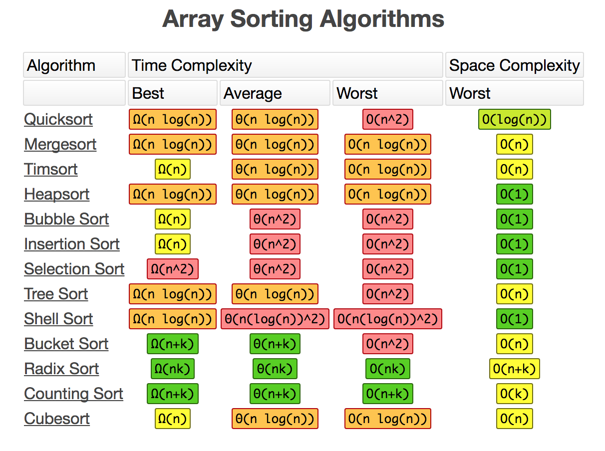

# Week 2 리뷰

## 4. 정렬과 탐색

알고리즘 문제의 가장 기본이라고 불리는 정렬과 탐색.
해당 챕터에선 3종류의 정렬 알고리즘과 그 원리.
그리고 이진 트리를 기반으로 한 탐색 알고리즘에 대해 알아본다.

## 4.1 정렬 알고리즘
기본적인 정렬 알고리즘은 크게 3가지로 나뉜다.
1. O(n^2) 
2. O(n log n )
3. 하이브리드

책에서는 해당 부분에 대해 아주 가볍게 언급하고 넘어간다.<br>
그러나 그 원리에 대해선 명확하게 기술하고 있다.


## 4.1.1 버블 정렬
O(n^2)의 가장 대표적인 정렬이다. <br>
이 알고리즘은 n개의 원소 마다 n번 순회하며, 현재 항과 다음 항만을 비교하여 해당 비교항이 역위인 경우 swap 함수를 실행한다.

> ### 역위(inversion)
> 역위란 해당 배열의 인덱스의 크기와 실제 원소항의 크기가 다를 경우를 의미한다.<br>
> 개별 원소 별로 체크 한다.
> ```
> [1,4,5,3,2,6] 인 경우, 
> 역위는 0부터 시작하는 순서 기준으로 [1,3], [1,4], [2,3], [2,4], [3,4] 총 5쌍이 존재한다.
> 결국 정렬 알고리즘 이란 역위를 제거하는 알고리즘인 셈이다. 
> ```

```js
// 무조건 처음부터 끝까지 돈다..
function bubbleSort(arr) {
  for (let i = 0; i < arr.length; i++) {
    for (let j = 0; j < arr.length - 1; j++) {
      if (arr[j] > arr[j+1]) {
        [arr[j], arr[j+1]] = [arr[j+1], arr[j]];
      }
    }
  }

  return arr;
}
```
## 4.1.2 병합 정렬
O(n log n)의 대표적인 정렬이다.<br>
병합 정렬은 단계마다 배열의 크기를 절반으로 줄여나가 배열이 원소단위가 지점까지 쪼갠다.

> ### 분할 정복 알고리즘<br>
> 문제를 작은 2개의 문제로 분리하고 각각을 해결한 다음, 결과를 모아서 원래의 문제를 해결하는 전략이다.<br>
분할 정복 방법은 대개 순환 호출을 이용하여 구현한다.

병합 정렬의 과정은 다음과 같다.
array[p...r]
0. 이라고 가정하자. 
1. **분할.** ppp와 rrr의 중간 qqq를 찾습니다. 이진 검색에서 중간점을 찾았던 것과 같은 방법으로 이 과정을 수행합니다: ppp와 rrr을 더해서 2로 나눈 후 내림을 하여 정수로 만듭니다.
2. **정복.** 분할 단계에서 만들어진 두 하위 문제 각각에 있는 하위 배열을 재귀적으로 정렬합니다. 즉 하위 배열 array[p..q]를 재귀적으로 정렬하고 또 하위 배열array[q+1..r]을 재귀적으로 정렬합니다.
3. **결합.** 정렬된 두 하위 배열을 하나의 정렬된 하위 배열인 array[p..r]로 결합합니다.

```js
const mergeSort = list => {
  const len = list.length;
  if (len < 2) return list;
  const middle = Math.floor(len);
  const left = list.slice(0, middle);
  const right = list.slice(middle, len);

  return merge(mergeSort(left), mergeSort(right));
}

const merge = (left, right) => {
  const result = [];

  while (left.length && right.length) {
    if (left[0] <= right[0]) result.push(left.shift());
    else result.push(right.shift());
  }

  while (left.length) result.push(left.shift());
  while (right.length) result.push(right.shift());

  return result;
}

mergeSort([4,1,2,5,1,4,56,9]);

// more js
const mergeSort = list => {
  const len = list.length;
  if (len === 1) return list;

  const center = Math.floor(len / 2);
  const left = list.slice(0, center);
  const right = list.slice(center);

  return merge(mergeSort(left), mergeSort(right));
}

const merge = (left, right) => {
  const results = [];

  while (left.length && right.length) {
    if (left[0] < right[0]) results.push(left.shift());
    else results.push(right.shift());
  }

  return [...results, ...left, ...right];
}

```

## 4.1.3 정렬의 하한
배열을 O(n log n)보다 빠르게 정렬하는 것은 불가능하다.<br>
그 하한에 대한 증명은 다음과 같다.

정렬을 하기 위해선 기본적으로 두 원소의 비교가 필요하다.<br>
결과는 두 가지 중 하나다. a가 b보다 크던가 b가 a보다 크던가.

## 4-E 기타 정렬
### 1. Quick Sort
best, worst: O(n Log n)<br>
퀵 정렬은 원리는 다음과 같다. 
1. base case / 배열의 길이가 1이면 리턴한다. 
2. 첫 번째 피벗은 마지막 항이다.
3. 배열을 순회하며, 피벗보다 작은 숫자는 left로, 피벗보다 큰 숫자는 right으로 삽입한다.
4. 모두 정렬될 때 까지 재귀로 돌며, 결과를 반환한다.

```js
function quickSort(array) {
  if(array.length < 2) return array;

  const pivot = array[array.length - 1];
  const left = [],
    right = [];

  for(let i = 0; i < array.length - 1; i++) {
    if(array[i] < pivot) left.push(array[i]);
    else right.push(array[i]);
  }

  return [...quickSort(left), pivot, ...quickSort(right)];
}
```

### 2. Counting Sort
O(n+k)<br>
계수 정렬. 배열의 길이를 알면 수행 가능.<br>
선형 시간 내에 수행이 가능하다.<br>
원리는 다음과 같다.

1. 최대 값 크기의 배열 생성.
2. 입력된 배열을 순회하며 해당 배열의 index를 카운트
3. 생성한 배열을 순회하며 반환할 배열을 만듬

```js
function countingSort (array, max) {
  const counts = new Array(max + 1);
  counts.fill(0);
  array.forEach(value => counts[value]++);

  const result = [];
  let resultIndex = 0;

  counts.forEach((count, index) => {
    for(let i = 0; i < count; i++) {
      result[resultIndex] = index;
      resultIndex++;
    }
  });

  return result;
}
```


## 참고 - 정렬 알고리즘의 시간복잡도 차트

